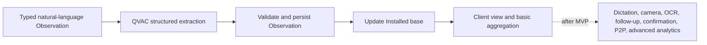

# FieldSight

The project turns what a field collaborator observes in a hospital into structured, reliable data about installed medical equipment, with conversational capture as simple as a conversation and inference running on the device. The solution is delivered as a **Web/Mobile app (Android/iOS)**: a field app for capture on the phone and a local-first dashboard for the installed base.

## Project scope

**Current focus:** build the MVP first. Post-MVP capabilities are reference material only and must not expand the current implementation scope until the MVP is complete.

The prototype is built in two explicit stages. The **MVP** is the reference implementation to build first:

- The Collaborator types a natural-language Observation.
- QVAC extracts Client/Site, Modality, brand, model, quantity, Age, and Use when present; required Age remains `Unknown` when unresolved.
- The data is validated and persisted as an Observation.
- The Observation updates the Installed base.
- The dashboard shows the installed base per Client and basic aggregation across Clients.

The **post-MVP** stage adds capabilities only after the MVP is complete:

- Dictation with Parakeet speech-to-text.
- Camera capture of equipment plates.
- OCR and VisionPsy extraction of brand, model, and manufacturing year.
- Automatic follow-up for Unknown fields.
- Independent confirmation, conflict handling, and peer-to-peer synchronization.
- Natural-language queries, freshness, Age and Use analytics, and renewal opportunities.

## Language

### Actors and occasions

**Collaborator**
: The field worker (service engineer, salesperson, specialist) who visits a Site and reports what they observe. The source of Field notes and the anchor of independent confirmation: a confirmations is independent only if it comes from a different Collaborator, or from a plate/label photo.
_Use when_: referring to who observes and reports equipment.
_Avoid_: User (unless the app-level actor is meant), observer, reporter.

**Visit**
: A single occasion a Collaborator spends at a Site, grouping the Field notes captured during that trip. Evidence from separate Visits (ideally by separate Collaborators) strengthens independence; the same Collaborator repeating a claim within one Visit is not independent.
_Use when_: referring to the occasion, not the utterance.
_Avoid_: Session, trip (unless the travel itself is meant) — reserve "visit" for the on-site occasion.

### Field observation

**Field note**
: The free-text, natural-language report a Collaborator speaks or types during a Visit to a Site. It is the raw uncleaned input utterance and the link to voice and photo capture; it yields one or more Observations. Dictation transcribed on-device is a Field note; voice is only a capture mechanism.
_Use when_: referring to the uncleaned input utterance.
_Avoid_: Report, visit note (unless the visit-level grouping is meant, not the utterance).

**Observation**
: A persisted structured record for one equipment group at a Site, keyed by Site × Modality × brand × model, carrying modality, brand, model, Age (a required min–max range or Unknown), quantity, and a state. The Field note renders into 1..n Observations — the model decides the count based on how specifically the collaborator distinguishes equipment (e.g. "two MRI machines" = one Observation with quantity=2; "one NovaMed MRI and one Celeris MRI" = two distinct Observations).
_Use when_: referring to the structured, state-carrying data record.
_Avoid_: Item, loose record — each Observation is the unit that carries a state.

**Modality**
: The normalized equipment category from a controlled vocabulary (MRI, CT, ultrasound, …); aliases like "MR" resolve to the canonical term. The stable dimension queries, dedup, and aggregation compare against.
_Use when_: referring to the normalized equipment type of an Observation or Installed equipment.
_Avoid_: Equipment type (if a brand-specific line is meant), generic equipment — reserve Modality for the controlled category.

**Age**
: The elapsed calendar time since an equipment group was installed or put into service, calculated relative to the observation date. The installation or commissioning date, when known, is the preferred evidence and may itself be a range; Age is derived from it as an inclusive min–max range in years and can be recalculated as time passes. An exact date produces a degenerate range (e.g. installed on 2018-06-01 and observed on 2026-09-09 → approximately 8–8 years). An installation range of 2017–2019 produces approximately 7–9 years. When installation evidence is unavailable, a manufacturing year read from a plate is only a proxy: it produces an Estimated Age range with uncertainty and is never treated as the exact installation date. Vague language without a defensible bound does not receive an invented numeric age; it triggers a follow-up or leaves Age Unknown. The range inherits its field provenance (Reported/Estimated/Confirmed); Unknown leaves it open.
_Use when_: referring to how long the equipment has been installed or operating.
_Avoid_: Age as a single point figure (false precision), manufacturing year as Age, equipment Use, or the commercial lifespan of a model.

**Use**
: The equipment's operating usage, measured in hours and kept distinct from Age. Use may describe accumulated operating hours or hours over a defined period; the period is optional and the observation date remains the source timestamp. A statement such as "used a lot" does not invent hours; it stays as a Comment or triggers a follow-up. Use does not determine when equipment is old.
_Use when_: referring to how intensively or how long equipment has operated.
_Avoid_: using Use as a substitute for installation age or as evidence of a model's commercial availability.

**Sales lifecycle**
: The period during which a manufacturer sells or commercially supports a model. It is a model-level commercial concept, distinct from the Age of a particular Installed equipment group and from its Use.
_Use when_: referring to commercial availability or support duration of a model.
_Avoid_: treating a 2–3 year sales lifecycle as the equipment's installation age or operating time.

**Comment**
: Free-text, non-structured context attached to an Observation — extra information that does not fit the equipment fields (modality, brand, model, age, quantity). It plays no role in matching, State, confidence, or renewal; it is captured from the same Field note/Evidence and stays visible in the evidence drill-down.
_Use when_: the collaborator adds context beyond the structured fields ("they plan to replace it next quarter").
_Avoid_: A Comment is not an Observation, not a structured field, and never a matching or dedup input.

### Institutions and locations

**Client**
: The health organization or commercial account that owns equipment — the row dimension of the installed-base view. A Client may hold one or more Sites (e.g. "DemoCare Health Group" owns "Hospital DemoCare Pacific" and "Hospital DemoCare Norte").
_Use when_: referring to the organization that buys and owns the equipment, not the specific building.
_Avoid_: Hospital (if a specific campus location is meant), account (unless the commercial account is meant).

**Site**
: A distinct physical location — a building or campus — where a collaborator observes equipment; the anchor of each Observation, which inherits the Client, city, and country. A Client may have multiple Sites.
_Use when_: referring to the concrete place a visit happened.
_Avoid_: Headquarters, branch, hospital (if the owning organization is meant) — reserve "site" for the visit anchor.

### Observation state

**State**
: Provenance of an Observation, not its quality. One of Reported, Estimated, Confirmed, or Unknown; calculated as the least firm of its fields (Confirmed > Reported > Estimated > Unknown). The Observation-level State reflects the worst-case provenance across all its fields.
_Use when_: referring to the record-level state of an Observation.
_Avoid_: Status, quality, validity — the state says where the data came from, not how good it is.

**Reported**
: Stated directly by the collaborator in a single Field note; the initial state of a new Observation.
_Use when_: the value was seen or said, without independent corroboration.

**Estimated**
: At least one value was inferred by the model (e.g. age "about eight years old", guessed brand) rather than stated directly.
_Use when_: the collaborator approximated or the model filled a gap by inference.

**Confirmed**
: Corroborated by an independent source: a second collaborator in a separate Field note, or a plate/label photo read.
_Use when_: dedup found a matching report, or a photo confirmed the record.

**Unknown**
: A required value is an open hole: not captured and not resolved by the automatic follow-up prompt.
_Use when_: the Observation exists but a field could not be determined.

### Installed base

**Installed equipment**
: The resolved identity of equipment at a Site, keyed by Site × Modality × brand × model (group level, not serial number), carrying the best current quantity and the Age envelope. Resolved from 1..n Observations that reconcile; created on the first unmatched report, strengthened to Confirmed by independent matching reports, and updated by pointed references ("one of the MRIs"). Quantity reconciles by max; Age reconciles as the inclusive envelope — min of all reported mins, max of all reported maxs — never dropping information.
_Use when_: referring to the deduplicated device/group that appears in the installed-base view.
_Avoid_: Item, asset, serialized physical unit (unless distinct beyond the group key), inventory.

**Conflicting observation**
: An independent report whose Age range does not overlap the record's current envelope (the union of reconciled ranges). It does not change the record State; it derives a "verify" marker on the Installed equipment that the dashboard surfaces until a deciding report or plate photo resolves the gap by widening or confirming the envelope.
_Use when_: referring to the disagreement signal between sources, not to the reconciliation rule.
_Avoid_: Match (matching is the act of grouping), discrepancy (the envelope is a union, not a correction).

**Independent confirmation**
: A corroboration of Installed equipment from a separate source: a second collaborator in a different Field note, or a plate/label photo read. The evidence that raises a record to Confirmed. Matching requires all four key fields (Site × Modality × brand × model) to overlap; a report missing any field creates a new Installed equipment entry until the gap is filled.
_Use when_: counting what corroborates a record.
_Avoid_: Match (the reconciliation act is not the corroboration itself), "like", "double-check" (casual reading).

**Installed base**
: The resolved, live view of Installed equipment per Client, Site, and geography, with aggregate quantities — the dataset queries, dedup, and renewal opportunities run against.
_Use when_: referring to the product-level dataset, not a single report.
_Avoid_: Inventory (implies physical audit), registry (implies single records).

**Confidence score**
: A product signal (0–100) for Installed equipment composed of completeness, freshness (time since the last confirmation), and independent confirmations; its weights are tuning parameters, not part of the domain model. High/Medium/Low labels shown in views are display buckets derived from the score, not a separate model.
_Use when_: referring to how reliable a record is believed to be.
_Avoid_: Quality (implies intrinsic merit, not provenance), validity.

**Renewal opportunity**
: A renewal candidate: Installed equipment whose Age envelope's lower bound (min) reaches a tuning threshold (default 8 years). Unknown age does not qualify; an Estimated range counts by its min. Dashboard queries for "older than N" use the same min semantics.
_Use when_: referring to a device the model flags as replaceable.
_Avoid_: Churn, upsell (commercial actions, not the candidate itself).

## Synthetic dataset contract

`docs/hackathon_rules/Dummy_Installed_Base_Hackathon.xlsx` is a synthetic development fixture and acceptance reference, not production customer data. Its `Dummy Installed Base` sheet contains 20 seed rows with geography, hospital, collaborator, visit date, modality, quantity, dummy brand/model, approximate age, estimated installation year, confidence bucket, state, source, field note, follow-up question/answer, and notes.

The fixture seeds and replays the MVP dashboard and extraction tests. `Customer / Hospital` maps to Client/Site context, `Observer` to Collaborator, and `Visit Date` to Visit. `MR` is an input alias normalized to the canonical Modality term. Approximate age becomes an inclusive range; installation year is derived evidence, never a second Age field. Workbook confidence buckets are display fixtures only. Missing brand or model remains `Unknown` and never triggers automatic reconciliation.
