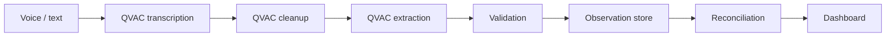

# FieldSight — Project Verification Guide

This guide gives maintainers and reviewers the shortest path to verify the project's critical technical and product claims. FieldSight was created from a challenge presented at ISD Summit.

## Evaluation map

| Criterion | Weight | Primary evidence |
| --- | ---: | --- |
| **Technical** | **35%** | QVAC native inference, multilingual Parakeet transcription, strict extraction contract, local persistence, no-cloud guard, tests |
| **Innovation** | **25%** | Conversational evidence → validated Observations → reconciled Installed base while preserving uncertainty |
| **Impact** | **20%** | Lower-friction field capture and better installed-base visibility without sending sensitive notes to cloud inference |
| **Design** | **10%** | Focused capture pipeline, editable AI intermediate result, responsive portfolio/dashboard views |
| **Completion** | **10%** | End-to-end dictation/text → extraction → persistence → reconciliation → dashboard flow |

## 1. Technical — 35%

**Claim:** FieldSight performs its AI transformations through QVAC on the device and has no cloud inference fallback.

Evidence:

- Native QVAC text runtime: `src/capture/qvac-runtime.native.ts`
- Native structured extractor: `src/capture/qvac-extractor.native.ts`
- Native multilingual transcription: `src/capture/qvac-transcription.native.ts`
- Local transcript cleanup: `src/capture/field-note-normalizer.native.ts`
- Microphone PCM capture: `src/capture/DictationControl.native.tsx`
- Structured extraction contract: `src/capture/qvac-contract.ts`
- Architecture decision: `docs/adr/0001-on-device-qvac-inference.md`
- Deterministic policy gate: `scripts/check-no-cloud-inference.mjs`
- CI enforcement: `.github/workflows/no-cloud-inference.yml`
- Runtime/smoke instructions: `docs/qvac/runtime-and-smoke.md`
- Full architecture: `docs/architecture.md`

Run:

```bash
npm ci
npm run verify
```

For the real native AI path, use a **physical Android/iOS device**. The browser deliberately does not emulate QVAC or route capture to a remote model.

## 2. Innovation — 25%

FieldSight treats field speech as evidence, not as a database row. The pipeline has distinct trust boundaries:

```text
voice
  → raw transcript
  → cleaned/reviewable Field note
  → structured Observation
  → reconciled Installed equipment
```

That distinction matters because an LLM transformation is not silently treated as truth. The user can inspect/edit the cleaned note, the structured result must pass a strict contract, and unresolved values remain Unknown instead of being fabricated.

## 3. Impact — 20%

Field teams continuously observe equipment that is commercially and operationally valuable, but conventional capture is fragmented and burdensome. FieldSight turns that distributed knowledge into an Installed base with lower capture friction while keeping inference close to the sensitive source data.

The resulting dataset supports Client/Site/geography views, equipment filtering, quantities, provenance/state, and downstream renewal/portfolio analysis.

## 4. Design — 10%

The product uses three primary surfaces:

1. **Overview** — portfolio-level signal and aggregate installed-base context.
2. **Capture** — a guided `Dictate → Transcribe → Clean → Extract` workflow with explicit QVAC/privacy state.
3. **Installed base** — reconciled records with Client, Site, country, Modality, brand, and model filtering.

The capture flow deliberately exposes the AI intermediate result instead of hiding it. This reduces automation surprise and gives the collaborator control before persistence.

## 5. Completion — 10%

The product path is implemented end-to-end:



Typed capture remains a low-risk fallback **within the local QVAC path** when microphone demonstration is inconvenient. Camera/OCR, P2P synchronization, and advanced conversational portfolio analytics remain outside the MVP path.

---

## Recommended demo sequence — ≤ 5 minutes

### 0:00–0:35 — Problem

Show the current fragmentation: field knowledge lives in notes, conversations, and memory. Explain that the useful data is observed where connectivity may be unreliable and customer context may be sensitive.

### 0:35–1:15 — Sovereign architecture

Show the architecture diagram in the README and briefly open the native QVAC runtime plus the no-cloud guard. The sentence to establish is simple: **audio and Field notes are transformed on the device; there is no cloud inference fallback.**

### 1:15–2:35 — Dictation → structured data

On a physical phone:

1. Open **Capture**.
2. Tap **Dictate observation**.
3. Speak a realistic note, preferably including count, modality, brand/model and one missing field.
4. Stop the recording.
5. Show the raw Parakeet transcript.
6. Show the cleaned Field note produced by the local QVAC LLM.
7. Make a small manual edit if useful to emphasize human review.
8. Run structured extraction and show the saved Observation.

This single sequence demonstrates QVAC, multimodal capture, local processing, UX, validation, and uncertainty handling at once.

### 2:35–3:35 — Reconciliation

Navigate to the Installed base and show that the Observation is no longer isolated free text: it participates in the resolved operational view. If the prepared fixture contains matching evidence, explain confirmation/conflict semantics briefly rather than spending demo time manufacturing a complex conflict live.

### 3:35–4:25 — Dashboard

Show Overview and Installed-base filtering across Client/Site/country/Modality/brand/model. Keep the focus on decision usefulness, not on UI navigation itself.

### 4:25–5:00 — Close

Close on four differentiators:

- QVAC-native inference at the edge.
- Multilingual conversational capture.
- Explicit uncertainty and deterministic validation/reconciliation.
- A judge-auditable architecture with no-cloud enforcement.

---

## Verification checklist

- [ ] Repository remains accessible to project reviewers.
- [ ] README retains the explicit **Preexisting base** declaration.
- [ ] No remote inference provider/client has been introduced.
- [ ] `npm run verify` succeeds on the current project revision.
- [ ] Physical-device QVAC text extraction is tested on the device used for the demo.
- [ ] Physical-device microphone + Parakeet dictation is tested before recording.
- [ ] First-use model downloads are completed before the demo so network latency does not interrupt it.
- [ ] A typed Field note is prepared as a deterministic backup demo path.
- [ ] Video is in Spanish, ≤5 minutes, and accessible without credentials.
- [ ] Repository and video are submitted before the official deadline.
