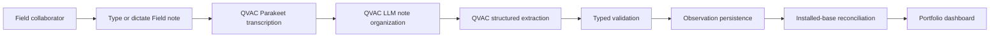
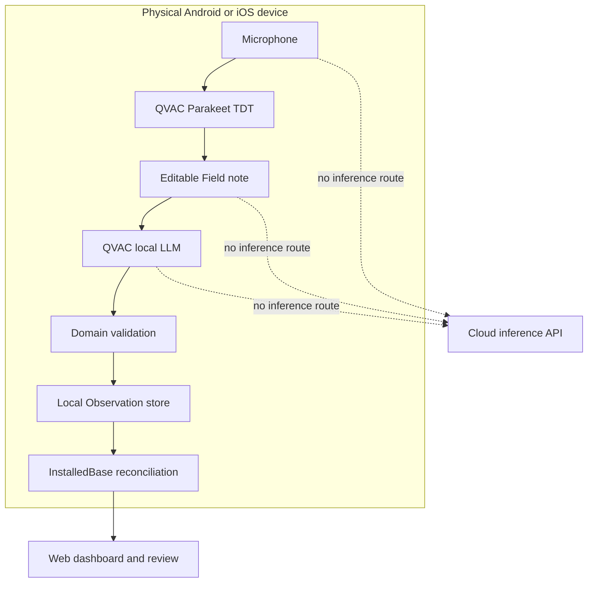
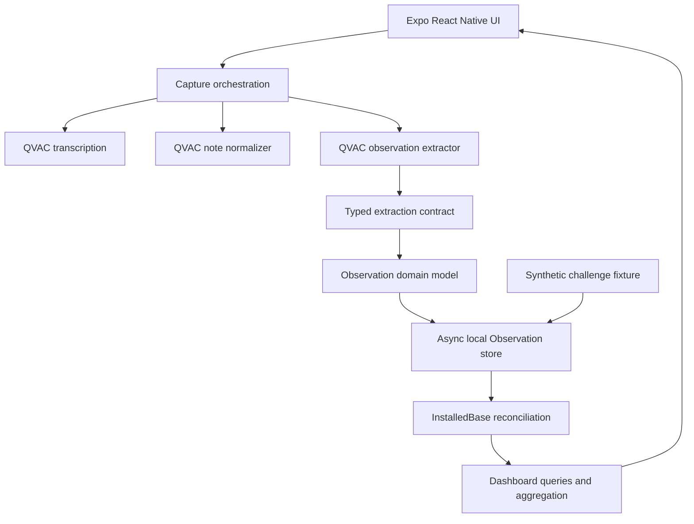
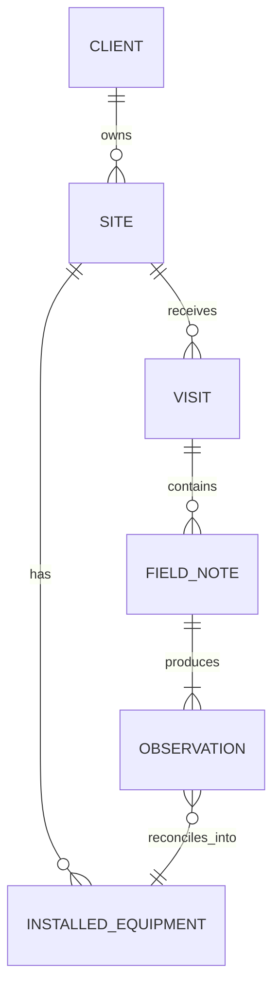
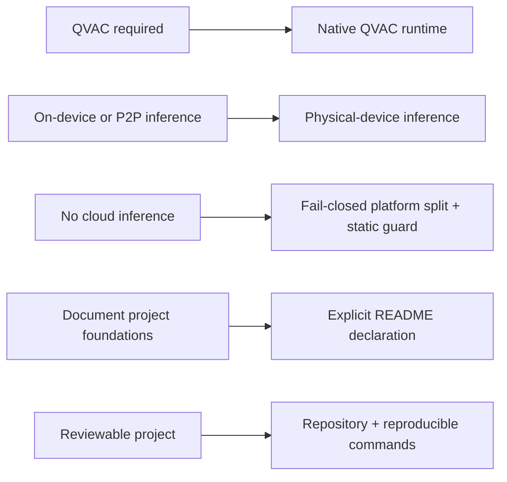

<div align="center">
  
</div>

# FieldSight

> **Sovereign installed-base intelligence: captured naturally, structured by QVAC, and kept on-device.**

FieldSight turns what a field collaborator observes during a customer visit into structured, auditable installed-equipment data. A collaborator can type a Field note or dictate naturally; QVAC transcribes speech locally, organizes the note locally, extracts strict Observations, validates them, persists them, and reconciles them into a live Installed base.

**Software project based on an ISD Summit challenge · QVAC**

> [!IMPORTANT]
> **No cloud inference.** The AI path uses QVAC on a physical Android/iOS device. Field notes and microphone audio are not sent to an external inference API. The web build is intentionally a dashboard/review surface and does not provide a cloud AI fallback.

## Project context

The ISD Summit challenge was fundamentally an installed-base intelligence problem: field knowledge must become usable, structured information about equipment at customer sites without losing provenance or inventing missing facts. FieldSight addresses that workflow directly.

The implemented path captures Client/Site context, geography, Modality, brand, model, quantity, Age, Use, comments, uncertainty/provenance, and the relationship between repeated observations and reconciled installed equipment. The included challenge workbook is used only as a synthetic fixture/reference.



Typed notes enter at the Field-note stage and skip transcription. Unknown data remains Unknown; the application does not fabricate values simply to complete a record.

## Product flow

### Capture

The Capture screen provides one editor for typed and dictated input. On a physical mobile device the microphone control captures PCM audio in memory. QVAC Parakeet TDT transcribes it locally. The raw transcript remains visible, while the local text model can improve punctuation and ordering without changing factual claims. The user can edit the Field note before selecting **Process with AI**.

### Structure and validate

The local QVAC text model extracts one or more Observations through a strict contract. Model output is validated before it can become persisted application data. This separates probabilistic extraction from deterministic domain integrity.

### Reconcile

Persisted Observations update the Installed base through deterministic reconciliation rules. FieldSight deliberately distinguishes raw evidence from resolved equipment knowledge.

### Inspect

The Overview and Installed-base screens expose useful portfolio signals, including equipment mix, client concentration, site footprint, geography, modality, brand/model, quantities, evidence, and provenance.

## Trust boundary



The no-cloud requirement is also checked by `scripts/check-no-cloud-inference.mjs`, which rejects prohibited network/inference-client patterns in the QVAC source path.

## Architecture



Detailed component boundaries and trust assumptions are documented in [`docs/architecture.md`](docs/architecture.md).

## Domain model



Canonical terminology is defined in [`CONTEXT.md`](CONTEXT.md):

- **Field note**: raw typed or transcribed natural-language evidence.
- **Observation**: one persisted structured claim about an equipment group.
- **State / provenance**: `Reported`, `Estimated`, `Confirmed`, or `Unknown`.
- **Installed equipment**: reconciled Site × Modality × brand × model identity.
- **Installed base**: the resolved portfolio view across clients, sites, and geographies.

## Native AI pipeline

| Stage | Runtime | Mechanism | Cloud inference |
| --- | --- | --- | --- |
| Voice capture | Device | `expo-audio` PCM stream | No |
| Transcription | QVAC | Parakeet TDT 0.6B | No |
| Note organization | QVAC | Llama 3.2 1B Instruct Q4 | No |
| Structured extraction | QVAC | Llama 3.2 1B Instruct Q4 | No |
| Validation | Device | TypeScript + Zod/domain rules | No |
| Persistence | Device | Async local store | No |
| Dashboard | Device/Web | Deterministic application logic | No AI inference |

Model artifacts and development dependencies may require connectivity when they are initially obtained. That provisioning step is distinct from inference; the product inference path does not call a cloud model API.

## Run locally

### Requirements

- Node.js 24 recommended for CI parity.
- npm.
- A modern browser for dashboard/review mode.
- A **physical Android API 29+ or iOS device** for native QVAC inference and microphone dictation.

```bash
git clone https://github.com/quantumquirkxyz/FieldSight.git
cd FieldSight
npm ci
npm start
```

Explicit targets:

```bash
npm run android
npm run ios
npm run web
```

Web mode intentionally does not emulate QVAC inference. Native AI capture requires the physical-device runtime.

## Verification

Run the complete deterministic verification gate:

```bash
npm run verify
```

It executes:

```bash
npm run check:no-cloud
npm run typecheck
npm test
npm run export:web
```

For repository-level review, also run:

```bash
npx expo-doctor
npm audit --audit-level=high
```

Where the QVAC host runtime is supported, the real-model extraction smoke path is:

```bash
node scripts/qvac-host-smoke.mjs
```

The host smoke script loads the configured Llama model, runs the same extraction contract, validates JSON and expected semantics, retries within a bounded policy, unloads the model, and exits non-zero on failure. Physical microphone + Parakeet execution must still be validated on the actual demo phone because generic CI cannot emulate the QVAC native worker and microphone hardware.

## Technical alignment



The project is designed around a decisive technical constraint from the ISD Summit challenge: inference stays on-device/P2P and does not use a cloud model endpoint. The repository also documents its foundations and verification path.

## Evaluation map

| Criterion | Weight | FieldSight evidence |
| --- | ---: | --- |
| Technical | 35% | QVAC native inference, Parakeet dictation, strict validation, local persistence, no-cloud guard, tests, smoke path |
| Innovation | 25% | Natural conversation to structured installed-base intelligence while retaining uncertainty and provenance |
| Impact | 20% | Converts distributed field knowledge into actionable customer/site visibility without centralizing sensitive notes for AI inference |
| Design | 10% | Responsive app, onboarding, focused capture composer, useful minimal analytics, explicit AI/privacy states |
| Completion | 10% | Capture → validation → persistence → reconciliation → dashboard, backed by deterministic fixture/tests |

See [`JUDGING.md`](JUDGING.md) for the project verification sequence and checklist.

## Data and privacy

The workbook under `docs/hackathon_rules/` is a synthetic development fixture, not production customer data. Missing information is represented explicitly instead of invented. Dictation audio is processed in memory by the native path and is not intentionally uploaded to an inference provider. Production deployment would still require the organization's normal access control, device management, data-retention, security, and regulatory review.

## Repository structure

```text
FieldSight/
├── src/
│   ├── capture/       QVAC runtime, voice, normalization, extraction
│   ├── dashboard/     projections and aggregation
│   ├── domain/        canonical domain model
│   ├── fixtures/      deterministic synthetic seed
│   ├── layout/        responsive application shell
│   ├── screens/       onboarding, overview, capture, installed base
│   ├── store/         persistence and reconciliation
│   ├── ui/            design tokens, components, and brand assets
│   └── validation/    strict data validation
├── docs/
│   ├── adr/           architecture decisions
│   ├── assets/        README/product visual assets
│   ├── hackathon_rules/ supplied synthetic fixture/reference material
│   ├── qvac/          QVAC execution documentation
│   └── research/      supporting research
├── scripts/           compliance and real-model verification
├── CONTEXT.md         canonical domain vocabulary
├── JUDGING.md         rubric and demo checklist
└── README.md
```

## Preexisting base — required declaration

The following project foundations and external components are documented for transparency. They are not presented as authored product logic:

- **quirk Skills workflow bundle**: `.agents/skills/`, `.claude/skills/`, and `skills-lock.json`; development/agent tooling present in this repository, not product runtime logic. Origin: this repository's Git history.
- **Expo / React Native scaffold and third-party libraries**: Expo, React, React Native/Web, Zod, Lucide, AsyncStorage, `expo-audio`, `expo-asset`, `react-native-svg`, and related configuration. Origins: their public upstream npm/Open Source projects; versions are pinned in `package.json` / `package-lock.json`.
- **QVAC platform and model artifacts**: official Tether QVAC stack used through `@qvac/sdk`, including the configured Llama text model and Parakeet transcription model. Origin: Tether QVAC SDK/model registry (`qvac.tether.io`).
- **Synthetic workbook**: `docs/hackathon_rules/Dummy_Installed_Base_Hackathon.xlsx`, retained as seed/reference data from the ISD Summit challenge. It is not production data.
- **Repository foundations**: scaffold, documentation, and application foundations maintained in `quantumquirkxyz/FieldSight`. Origin: this repository's Git history.

The project includes the installed-base domain contract, QVAC capture/extraction path, strict validation, persistence/reconciliation, dashboard experience, multilingual voice integration, no-cloud guard, and reviewable product flow.

## Documentation

- [`docs/problem-statement.md`](docs/problem-statement.md) — challenge interpretation and minimum scope.
- [`docs/proposal-solution.md`](docs/proposal-solution.md) — broader product proposal.
- [`docs/architecture.md`](docs/architecture.md) — runtime, data-flow, and trust-boundary architecture.
- [`docs/qvac/dictation.md`](docs/qvac/dictation.md) — native dictation path.
- [`docs/qvac/runtime-and-smoke.md`](docs/qvac/runtime-and-smoke.md) — QVAC execution and smoke verification.
- [`docs/adr/`](docs/adr/) — architecture decisions.
- [`CONTEXT.md`](CONTEXT.md) — canonical vocabulary.
- [`JUDGING.md`](JUDGING.md) — evaluation evidence and final checklist.

---

**FieldSight — useful field intelligence without surrendering field data.**
