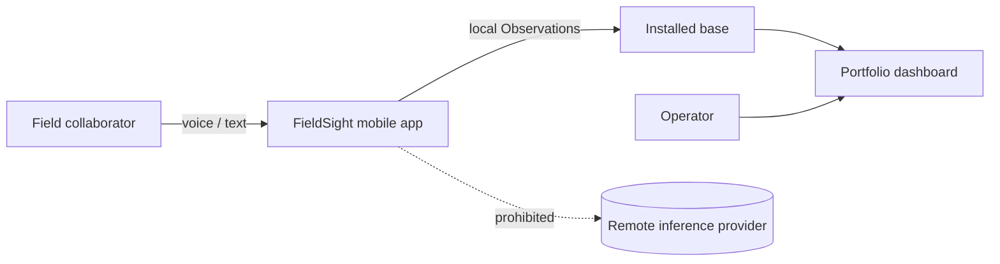
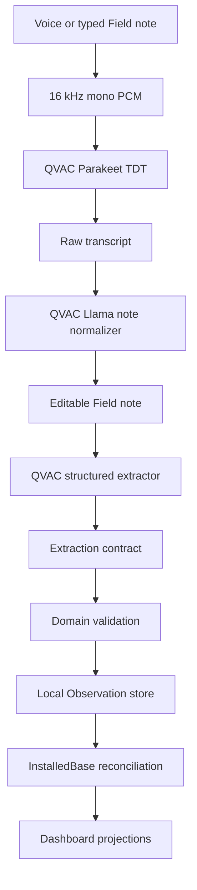
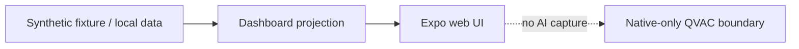
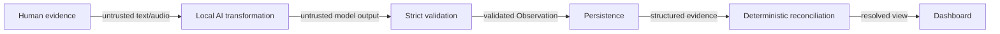

# FieldSight Architecture

## Purpose

This document describes the architecture of the FieldSight software project. It is intentionally focused on the MVP: every component below supports a local-first flow from a Field note to a reconciled Installed base. The project was created from a challenge presented at ISD Summit.

## Architectural constraints

FieldSight is designed around four constraints:

1. **Inference sovereignty.** AI inference must execute on the device through QVAC; a cloud inference fallback is not permitted.
2. **Uncertain field evidence.** Missing or approximate information must remain explicit rather than being invented.
3. **Intermittent connectivity.** Capture and core transformation cannot depend on a stable network connection.
4. **Verifiability.** The technical boundary must be inspectable through code, tests, ADRs, and deterministic verification commands.

## System context



## Runtime topology

### Native mobile

The physical Android/iOS application owns the complete AI capture path.



Voice capture uses an in-memory PCM stream. The requested format is mono signed 16-bit PCM at 16 kHz. If the device supplies a different sample rate, the capture component resamples locally before handing audio to QVAC.

Parakeet is loaded for the dictation operation and unloaded after transcription. The text-generation model remains the shared QVAC model for cleanup and structured extraction.

### Web

The web build is a review/dashboard surface. It loads fixtures and deterministic application logic but deliberately does not substitute a browser or cloud model for the native QVAC inference path.



This separation prevents a demo convenience from weakening the project's on-device inference requirement.

## Component responsibilities

| Component | Responsibility | Failure behavior |
| --- | --- | --- |
| `DictationControl.native.tsx` | Capture microphone PCM, request permission, resample locally | Stops and surfaces an actionable local error |
| `qvac-transcription.native.ts` | Load Parakeet, transcribe, unload | Never falls back to remote ASR |
| `field-note-normalizer.native.ts` | Remove speech disfluencies without changing facts | Error is surfaced; raw transcript remains available to the orchestration layer |
| `qvac-extractor.native.ts` | Invoke the local QVAC text model for structured extraction | Contract/retry path rejects unusable output |
| `qvac-contract.ts` | Define the model prompt and strict extraction boundary | Invalid model output is rejected |
| `observation-capture.ts` | Convert validated extraction output into Observations | Persistence occurs only after validation |
| `async-observation-store.ts` | Persist Observations locally | Duplicate IDs are rejected deterministically |
| `installed-base.ts` | Reconcile Observations into resolved installed equipment | Preserves uncertainty and conflict semantics |
| `dashboard.ts` | Produce deterministic query/aggregation projections | Empty/offline/no-results states remain explicit |

## Data flow and trust boundaries



The important design decision is that **model output is never the system of record by itself**. QVAC generates candidate structured data; validation establishes whether that candidate can enter the local data plane.

## Observation semantics

The canonical vocabulary lives in [`../CONTEXT.md`](../CONTEXT.md). In particular:

- A **Field note** is raw evidence.
- An **Observation** is a structured persisted claim.
- **State** is provenance, not generic confidence.
- **Installed equipment** is the reconciled group-level identity.
- **Age** is represented as a range or Unknown to avoid false precision.
- **Use** remains separate from Age.

## No-cloud inference controls

The architecture uses defense in depth rather than relying on a README claim:

1. Native AI calls are made through `@qvac/sdk`.
2. Non-native QVAC modules fail closed instead of calling a remote model.
3. `scripts/check-no-cloud-inference.mjs` scans for prohibited inference-client patterns.
4. `.github/workflows/no-cloud-inference.yml` runs the guard, TypeScript validation, tests, and web export.
5. ADR 0001 records the decision as an architectural invariant.

## Model verification strategy

There are two distinct verification levels.

### Deterministic CI

```bash
npm run check:no-cloud
npm run typecheck
npm test
npm run export:web
```

These checks are repeatable in GitHub Actions and protect the repository on every relevant change.

### Real runtime

```bash
node scripts/qvac-host-smoke.mjs
```

The host smoke path loads the real Llama model, executes the same extraction contract used by the application, validates semantics, and unloads the model. Native microphone and Parakeet behavior requires a physical Android/iOS validation because CI cannot reproduce the target device runtime and microphone stack.

## Memory and latency considerations

FieldSight intentionally does not keep every AI model resident. The text-generation model is loaded as the core native inference runtime. Parakeet is loaded only when dictation is needed and unloaded immediately after transcription. This trades some first-use latency for lower sustained device memory pressure, which is a better default for a software project expected to run on heterogeneous phones.

For a production version, model lifecycle management should become an explicit scheduler based on device RAM, thermal state, battery, and expected capture frequency.

## Security and privacy considerations

The current prototype establishes an inference boundary, not a complete enterprise security program. Production deployment would additionally require device encryption policy, authentication/authorization, tenant isolation, key management, retention controls, audit logging, mobile-device management, secure synchronization, and organizational privacy review.

## Extension points

The architecture intentionally leaves narrow seams for future product capabilities:

- camera/plate evidence feeding the same Observation contract;
- automatic follow-up prompts for Unknown fields;
- P2P synchronization and independent confirmations;
- local natural-language queries against the resolved Installed base;
- model lifecycle optimization and quantization benchmarking.

Those extensions should preserve the same invariant: AI proposes structured evidence locally; deterministic domain rules decide what becomes persisted knowledge.
