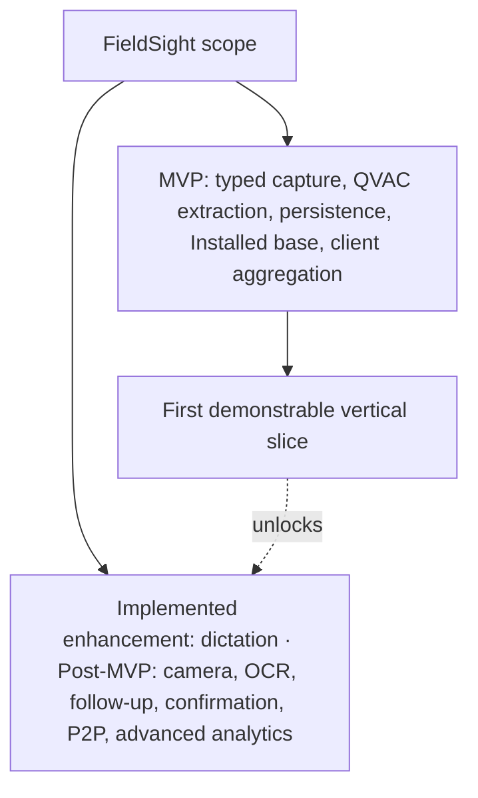
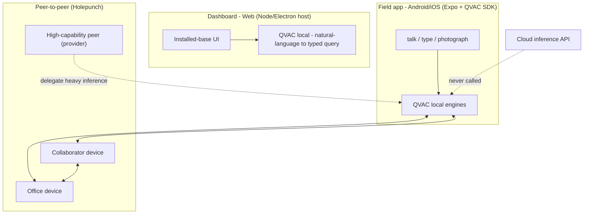
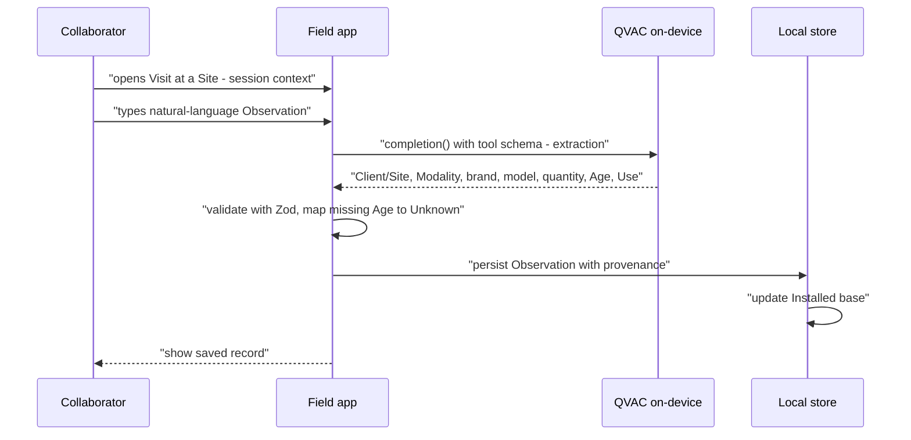
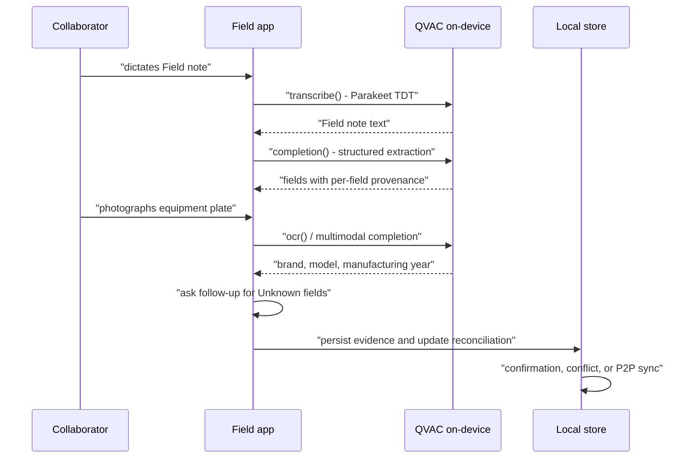
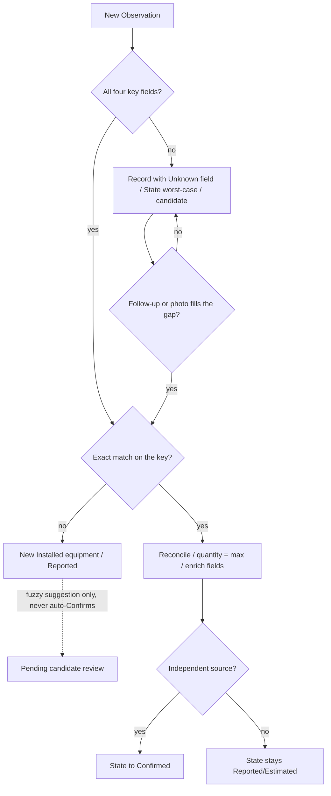
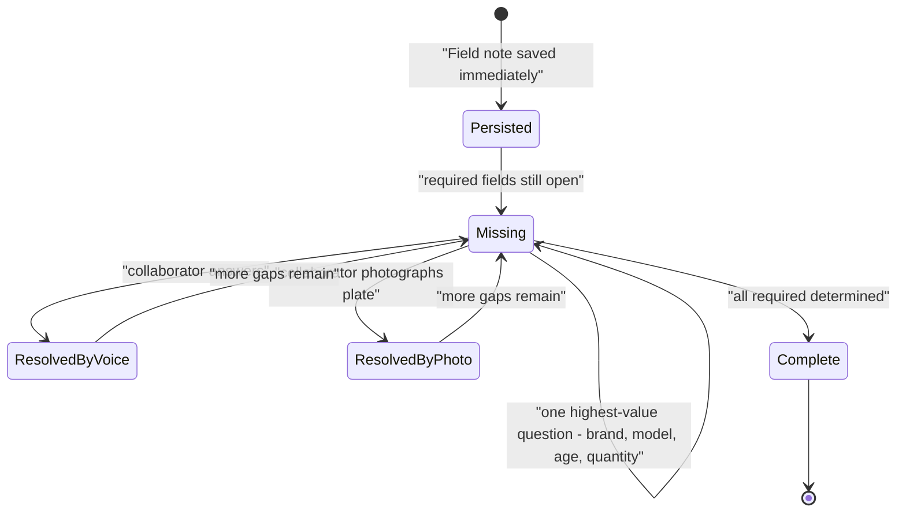
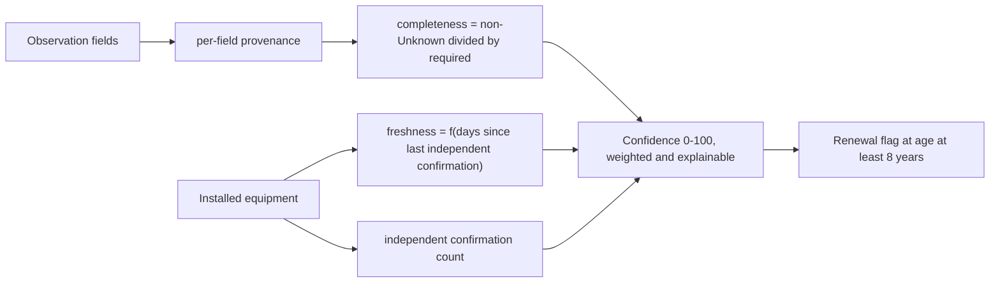

# Solution Proposal — FieldSight

**Working title:** FieldSight ("the installed base, seen clearly from the field").
Naming is an open decision — confirm or replace before the demo.

**Mission:** turn what a field collaborator observes in a hospital into structured, reliable data about installed medical equipment, with capture as simple as a conversation and every inference running on the device or between peers.

**Delivery form:** a **Web/Mobile app (Android/iOS)** — a mobile field app for capture and a local-first web dashboard for the installed base.

---

## 1. Mandatory rules — compliance before anything else

These constraints originate from the ISD Summit challenge that informed FieldSight and continue to guide the software architecture.

| Rule | Consequence for the build |
|---|---|
| All inference must run on-device or P2P via QVAC | Every AI step (transcription, extraction, OCR, vision, NL→query) calls the QVAC SDK. No cloud API is ever invoked. |
| Cloud may be used for *non-inference* functions (interface hosting, non-sensitive storage) | The dashboard could be hosted as pure UI, but we keep all data local-first because observations are sensitive client data. |
| Maintain a reproducible and reviewable software project | The repository documents its foundations, runtime requirements, verification commands, and product boundaries. |
| Demonstrate a complete offline-first flow | The project can be evaluated through its tests, local fixtures, and end-to-end product path. |

---

## 2. Shared understanding (the domain model we refined)

This repository already carries the refined domain model in `CONTEXT.md`, `docs/problem-statement.md`, and `docs/adr/`. The solution proposal is built on it, not around it.

| Decision | Where it lives |
|---|---|
| Client → Site is one-to-many; Observation anchors to a Site and inherits Client, city, country | `CONTEXT.md` — Client, Site |
| Observation is keyed by Site × Modality × brand × model; the Field note decides the count (specificity) | `CONTEXT.md` — Observation |
| Modality is a closed but broad controlled vocabulary (+ Other); aliases resolve to the canonical term | `CONTEXT.md` — Modality |
| State is per-field provenance; record State = worst case (Confirmed > Reported > Estimated > Unknown) | `CONTEXT.md` — State; `ADR 0003` |
| Installed-equipment matching is strict on all four key fields; a missing field creates a record until the gap fills | `CONTEXT.md` — Independent confirmation; `ADR 0002` |
| Quantity reconciles by max; "one of the X" references the group, it is not a count | `CONTEXT.md` — Installed equipment; session Q16–18 |
| Confidence (0–100) = completeness (non-Unknown ÷ required) + freshness (time since last independent confirmation) + independent confirmations; explainable weights | `CONTEXT.md` — Confidence score |
| Age is an inclusive min–max range (an exact figure is the degenerate point); plate/installation year is a proxy that derives the range, never a separate field | `CONTEXT.md` — Age |
| Installed equipment reconciles Age by envelope (union of ranges, never dropped); a non-overlapping independent report derives a "verify" conflict marker without touching the State | `CONTEXT.md` — Conflicting observation; `ADR 0005` |
| Renewal fires when envelope min reaches the tuning threshold (default 8); "older than N" queries use the same min semantics | `CONTEXT.md` — Renewal opportunity; `ADR 0005` |
| High/Medium/Low are display buckets derived from the 0–100 score, not a separate model | `CONTEXT.md` — Confidence score |
| Comment is free text on the Observation with no role in matching/State/confidence/renewal | `CONTEXT.md` — Comment |
| Follow-up asks one field per turn, highest-value first; the Observation persists immediately, never blocked | session Q9–10 |
| Photo can create or confirm; plate photo + second collaborator are the only independent sources | session Q11 |
| Transcription is a capture mechanism; the transcription *is* the Field note | session Q12 |
| Collaborator and Visit are first-class: confirmation is independent only across different Collaborators/Visits | `CONTEXT.md` — Collaborator, Visit |
| Field notes are accepted in any language; output normalizes to the English Modality canon | session Q18 |
| Site resolves from the active session context; QVAC verifies if the Field note names another | session Q17 |
| The supplied XLSX is a synthetic seed/acceptance fixture, not a production schema or customer data source | `ADR 0007` |

---

## 3. Product overview

FieldSight is two surfaces over one shared, offline-first core:

1. **Field app (Android/iOS)** — the collaborator's MVP capture tool. Type a natural-language Observation; QVAC extracts structured data locally; nothing leaves the device.
2. **Dashboard (web, local-first)** — the MVP installed-base view for the organization: client-level equipment and basic aggregation across Clients.

The MVP demo tells one vertical slice end-to-end:

> **One typed Observation → structured record → Installed base → client-level aggregation.**

Multilingual voice dictation is implemented in the current project. Camera, OCR, automated follow-up, peer confirmation, P2P synchronization, and advanced analytics remain post-MVP capabilities (`ADR 0006`).

---

## 4. Web/Mobile (Android/iOS) — why and how

QVAC's runtime matrix decides the shape: the JS/TS SDK (`@qvac/sdk`) runs on **Node.js, Bare, and Expo (Android/iOS)**. There is **no browser runtime** — the engines are native (`llamacpp`, Whisper/Parakeet, ONNX OCR, vision). The official QVAC tutorial for mobile is an Expo app using `react-native-bare-kit` + the `@qvac/sdk/expo-plugin` on a physical device.

Why not a plain website? A browser cannot host the QVAC worker. And why a dashboard at all? The installed-base view and renewals are where the business value materializes.

---

## 5. Architecture

### 5.1 QVAC capability mapping

Every AI step maps to a QVAC task with a concrete, small model — keeping the prototype lean and genuinely device-capped.

| Product step | QVAC task | Recommended model | Notes |
|---|---|---|---|
| Voice → Field note (implemented) | Transcription (ASR, speech→text: `transcribe()` / `transcribeStream()`) | **Parakeet TDT 0.6B** (multilingual, ~750 MB) | Implemented local dictation path; PCM capture followed by local transcription |
| Field note → structured fields (MVP) | Text generation (`completion()` + tool schema) | **LLAMA_3_2_1B_INST_Q4_0** or **QWEN3_600M_INST_Q4** | Typed natural-language input; tool-call JSON validated by Zod |
| Photo plate → text (post-MVP) | OCR (`ocr()`) | **OCR_LATIN** (CRAFT + recognizer) | Returns blocks with text + bbox + confidence |
| Photo → brand/model/age/read label (post-MVP) | Multimodal (`completion()` + `projectionModelSrc`) | **VisionPsy-Nano 460M** + mmproj | Confirms or creates; image never leaves device |
| NL query → typed filter (post-MVP) | Text generation (tool schema) | same 1B LLM | Never raw SQL — validated typed filter, deterministic query |
| Speaker / field note separation | Transcription diarization (optional) | Parakeet Sortformer | Nice-to-have, not MVP |
| Heavy inference on weak phones | Delegated inference P2P | `loadModel({ delegate: { providerPublicKey, fallbackToLocal: true } })` | Cold DHT bootstrap 15–45 s, then sub-second |

### 5.2 MVP field capture flow

The minimum path deliberately uses typed natural language. It proves the required capture, extraction, storage, and visualization loop without depending on voice, camera, or post-MVP reconciliation.

### 5.3 Extended capture flow (implemented voice + future vision)

The following flow is intentionally separate. It adds capture mechanisms and automated enrichment only after the MVP path is complete.

### 5.4 Reconciliation and confirmation

Strict four-field matching (`ADR 0002`) with an explicit **unknown-field candidate** path, so partial reports never silently merge and never falsely confirm.

### 5.5 Follow-up conversation

### 5.6 Confidence score

A transparent, explainable formula — no second opaque signal.

Proposed weights (tuning parameters, not domain): 0.40 × completeness + 0.25 × freshness + 0.35 × confirmation. The UI always shows *why* a score is what it is.

### 5.7 Data and lineage model

| Entity | Role |
|---|---|
| `Evidence` | Source artifact: field_note (transcription), photo, typed entry. Holds raw content + QVAC task/model used. |
| `ExtractedValue` | One field value + provenance (Confirmed/Reported/Estimated/Unknown) + `evidenceId` + extraction confidence. |
| `Observation` | Structured record for one equipment group (key Site×Modality×brand×model), carrying modality, brand, model, age, quantity and the derived record State. Immutable; each source appends. |
| `Installed equipment` | Reconciled view per key, quantity = max, Age envelope (union of ranges), best current fields, confirmation count, last independent confirmation. Materialized incrementally, **recomputable from Observations**. |
| `Visit` / `Collaborator` | The independence backbone — only separate sources raise confirmed. |

### 5.8 Synthetic workbook adapter

The workbook seeds the MVP with 20 deterministic synthetic rows. The adapter maps hospital/customer and geography into Client/Site, observer/date into Collaborator/Visit, normalizes `MR` to the canonical modality, converts scalar approximate age into an inclusive range, and preserves missing brand/model as `Unknown`. Its confidence labels are fixture presentation values only. `Agent Question Logic` and `Voice Test Prompts` are test vectors and post-MVP references; typed capture remains the MVP input.

---

## 6. Field app — mobile details (Android/iOS)

Stack and key decisions (grounded in the official QVAC Expo tutorial and docs):

- **Expo SDK 54 + TypeScript**; single codebase for Android and iOS.
- `@qvac/sdk` with peer deps `bare-rpc`, `react-native-bare-kit`, `bare-pack`; `@qvac/sdk/expo-plugin` in `app.json`; `qvac.config.json` enabling **only** the plugins the app needs (LLM completion, transcription, OCR, vision) to keep engine footprint small.
- **Physical device required** (engines do not run on emulators) — documented in README; demo deviceready plan from hour 1.
- Local store: `expo-sqlite` for the structured dataset + `expo-file-system` for photos/audio/files.
- Model distribution: `downloadAsset`/`loadModel` with `onProgress`, pause/resume, sharded models; models fetched from the **distributed model registry** or **peers** (no central AI service).
- Implemented session flow: open Capture → type or dictate a Field note → review → local QVAC extraction → validate → save.
- Post-MVP extensions: add photo/OCR, automated follow-up, independent confirmation workflows, and synchronization.
- Offline-first: everything runs with no connectivity; download + load is the only "ready" gate and is shown transparently in the UI.

---

## 7. Dashboard — web (local-first) details

- Hosted as a local web app (Node/Electron or Expo web) so QVAC inference stays on-device; the rules permit cloud interface hosting, but observations are sensitive, so data never leaves the user's machine unless shared P2P.
- MVP views: **Installed base** (filter by Client/Site/Modality/brand/model and show quantity, Age, and Use when present), **basic aggregations** by Client and Site.
- Post-MVP views: **Evidence drill-down** (Field notes, photos, Collaborators, Visits, provenance per field), **Renewal radar**, freshness, advanced Age/Use analytics, and natural-language queries.
- Age is required in the Observation schema, but incomplete capture persists explicitly as `Unknown`; it never blocks the Field note from being saved.
- Age aggregation keeps the original range visible and uses actionable bands: **Age unknown**, **Less than 8 years** (`max < 8`), **Renewal candidate** (`min >= 8`), and **Needs verification** when the range crosses the threshold (`min < 8 <= max`) or has an active conflict marker.
- **Natural-language query**: QVAC converts the question to a validated typed filter (Zod); a deterministic local query executes it. Raw model SQL is never executed.
- Recomputable: recalculation from Observations is supported, so rule changes don't strand materialized state.

---

## 8. Delivery plan

The current implementation focus is the MVP. Post-MVP work starts only after every MVP item below is complete.

### MVP scope (vertical slice first, in order)

1. Expo app boots on a physical device with QVAC smoke test (model download → load → completion).
2. Typed natural-language Observation → structured extraction (tool-schema JSON + Zod), including required Age with `Unknown` when unresolved.
3. Observation persist with per-field provenance and record State.
4. Observation updates Installed equipment and the dashboard shows the installed base per Client.
5. Basic aggregation across Clients by Site, Modality, brand, model, quantity, Age, and Use when present.
6. Load the synthetic workbook through the adapter so the dashboard starts with 20 deterministic synthetic rows.

### Post-MVP, after the MVP is complete

- Dictation with Parakeet speech-to-text.
- Camera capture of equipment plates.
- OCR and VisionPsy extraction of brand, model, and manufacturing year.
- Automatic follow-up for Unknown fields.
- Independent confirmation, conflict handling, and P2P synchronization.
- Natural-language queries, freshness, Age and Use analytics, and renewal opportunities.

### Won't (explicitly out of scope)

- Custom model training or on-device fine-tuning as a product feature (mention as roadmap only).
- Cloud sync, multi-tenant backend, enterprise auth, exhaustive device taxonomy.
- Text-to-speech / voice assistant read-back of follow-up questions (roadmap only; transcription is the capture mechanism, never synthesis).
- Autonomous fuzzy dedup — suggestions only, never silent confirmation.

---

## 9. Demo script (video ≤5 min, Spanish)

| Time | Beat |
|---|---|
| 0:00–0:35 | Problem: installed-equipment knowledge lives in personal notes; nothing is verified; renewals are guesses. |
| 0:35–1:30 | MVP capture: Collaborator types a natural-language Observation; local QVAC extraction returns structured fields, including Age/Use when present. |
| 1:30–2:20 | Validation and storage: incomplete Age remains `Unknown`; the Observation is persisted and updates Installed equipment. |
| 2:20–3:20 | Client view: dashboard shows equipment by Client, Site, Modality, brand/model, quantity, Age, and Use when present. |
| 3:20–4:20 | Basic aggregation: show where a model or Modality is installed across several Clients and Sites. |
| 4:20–5:00 | Differentiation: the MVP proves the local QVAC intelligence layer; voice, camera, and advanced reconciliation are clearly post-MVP. |

---

## 10. Risks and mitigations

| Risk | Mitigation |
|---|---|
| **Inference boundary violation**: an inference path that touches a cloud API | Architecture with no cloud path; no SDK call can route to a remote provider; README documents the QVAC-only route. |
| Extraction returns unstable/invalid JSON | Tool-schema output + Zod validation + local retry; never invent values — map missing to Unknown/Estimated. |
| Vision/OCR fails on a plate | Manual correction path (Reported), follow-up asks to re-photograph; OCR blocks carry confidence. |
| Weak phone hardware / slow models | Model plan tiers (1B default, 600M fallback); P2P delegation with `fallbackToLocal`; model download progress UI. |
| Expo/engines do not run on emulator | Physical device tested on day 1; README states the requirement. |
| Scope creep | Vertical slice first; everything beyond the MVP is explicitly deferred. |
| Unclear project foundations | README documents the project's sources, dependencies, and runtime boundaries. |

---

## 11. Repository hygiene

- `README.md`: product one-liner, run instructions, physical-device requirement, `Pre-existing work and sources`, QVAC capability map, and a note that every inference is on-device or P2P.
- `docs/`: this proposal, `problem-statement.md`, `CONTEXT.md` glossary, ADRs.
- Synthetic fixtures checked in so the product flow can be reproduced offline.
