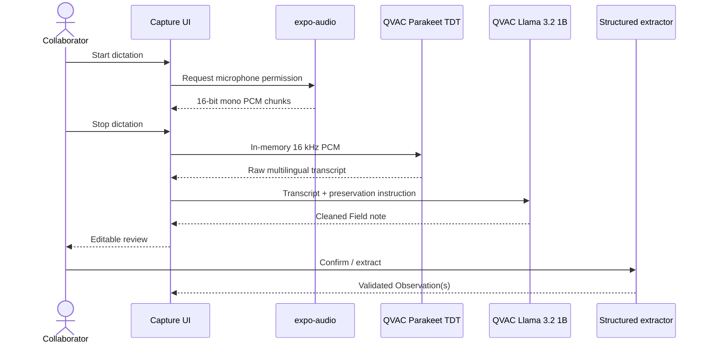

# QVAC Multilingual Dictation

## Objective

The dictation path reduces field-entry friction without weakening the hackathon's local-inference requirement. Microphone audio is captured on a physical mobile device, transcribed with QVAC Parakeet, cleaned by the local QVAC text model, and returned to the user as an editable Field note before structured extraction.

## Pipeline



## Audio capture contract

The native capture component requests:

- one channel (mono);
- signed 16-bit PCM;
- 16,000 Hz sample rate;
- in-memory buffers through `expo-audio`'s audio stream API.

Mobile hardware may report an actual sample rate different from the requested rate. `DictationControl.native.tsx` therefore performs local linear PCM resampling to 16 kHz before handing the buffer to QVAC. No remote conversion/transcoding service is involved.

A recording shorter than approximately one second is rejected before transcription to avoid wasting model work on accidental taps.

## Transcription model

FieldSight uses the QVAC SDK registry constant:

```ts
PARAKEET_TDT_0_6B_V3_Q8_0
```

and loads the registry model directly:

```ts
await loadModel({ modelSrc: PARAKEET_TDT_0_6B_V3_Q8_0 });
```

The registry constant carries the engine metadata required by the current QVAC SDK. This avoids depending on legacy Parakeet variant configuration while allowing the SDK to select the compatible transcription plugin. The TDT variant is selected because it supports multilingual speech recognition. The implementation calls `transcribe()` with the in-memory PCM buffer and unloads the Parakeet model in a `finally` block.

## Transcript normalization

Speech recognition output often contains filler words, repeated phrases, or punctuation artifacts. FieldSight uses the already-loaded local QVAC text-generation model to normalize the transcript before structured extraction.

The normalization instruction establishes a conservative transformation boundary:

- preserve factual claims;
- preserve numbers, brands, models, places, negations, and uncertainty markers;
- never fill missing facts;
- remove speech disfluencies;
- repair punctuation;
- reorder fragments only when readability improves;
- preserve the speaker's language;
- return only the cleaned Field note.

The raw transcript remains visible in the capture screen while the cleaned Field note is editable by the collaborator. This human-review checkpoint is intentional: normalization is an AI transformation, not a source of truth.

## Error handling

| Failure | Behavior |
| --- | --- |
| Microphone permission denied | Stop before recording and show an actionable permission error |
| Empty/very short recording | Reject locally before model load |
| Parakeet model load/transcription failure | Surface error; never use cloud ASR |
| Empty transcription | Surface error and retain the capture screen |
| Text normalization failure | Surface error rather than silently changing evidence |
| Web runtime | Explain that dictation/QVAC capture requires a physical device |

## Privacy boundary

The implemented pipeline contains no cloud ASR or cloud LLM client. Audio is captured into application memory for local processing. A production implementation should additionally define explicit audio-buffer zeroization/retention policies, device encryption requirements, and application lifecycle behavior for interruptions or backgrounding.

## Device verification checklist

Before recording the hackathon demo:

1. Build/run FieldSight on the target physical Android/iOS device.
2. Complete first-use downloads for the Llama and Parakeet model artifacts.
3. Disable network connectivity after provisioning if you want to make the local-execution property visible during the demo.
4. Open **Capture** and confirm the QVAC state reads as ready.
5. Dictate one sentence in Spanish and verify raw transcript + cleaned note.
6. Repeat with a second language supported by the chosen Parakeet TDT checkpoint if demonstrating multilingual behavior.
7. Extract the Field note and confirm the Observation appears in the Installed base.
8. Keep a typed Field note prepared as a deterministic backup path.

## Relevant files

- `src/capture/DictationControl.native.tsx`
- `src/capture/qvac-transcription.native.ts`
- `src/capture/field-note-normalizer.native.ts`
- `src/App.tsx`
- `src/screens/CaptureScreen.tsx`
- `app.json`
